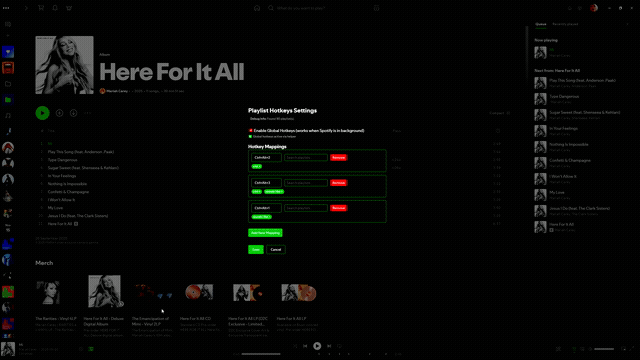

# Spicetify Playlist Hotkeys

Add the currently playing Spotify track to one or more playlists with configurable hotkeys. The extension supports focused Spotify shortcuts by default and helper-backed global shortcuts when you want hotkeys to work while Spotify is in the background.

## Features

- Custom hotkeys: map key combinations to one or more playlists.
- Multi-playlist actions: add the current track to several playlists at once.
- Auto-like support: like the track as part of the playlist action.
- Focused mode: shortcuts work while Spotify is the active window.
- Global mode: optional local helper enables OS-level background hotkeys.
- React settings UI: settings button, modal, focused/global mode toggle, helper status banner, hotkey capture, and searchable playlist picker.
- Smart feedback: single-playlist actions use a compact toast; medium batches use stacked notifications when available; large batches use a summary modal when available.

## Installation

### Prerequisites

- [Spotify desktop app](https://www.spotify.com/download/)
- [Spicetify](https://spicetify.app/) installed, configured, and available on `PATH`
- Node.js and npm

The current build uses `spicetify-creator`, which calls the `spicetify` CLI during the build. If `npm run build` fails with `spicetify: not found`, install/fix Spicetify first and reopen your shell so `spicetify -c` works.

### Build and install

```bash
git clone <this-repo>
cd spicetify-playlist-hotkeys
npm install
npm run build
```

The production build emits the extension as `dist/playlist-hotkeys.js`.

Copy it into your Spicetify extensions directory and enable it:

```bash
# Find your Spicetify paths
spicetify path

# Linux/macOS example; adjust if `spicetify path` reports a different extensions dir
cp dist/playlist-hotkeys.js ~/.config/spicetify/Extensions/playlist-hotkeys.js

spicetify config extensions playlist-hotkeys.js
spicetify apply
```

After Spotify reloads, look for the Playlist Hotkeys button in the bottom playbar and open the settings modal.

## Usage

### Configure mappings

1. Click the Playlist Hotkeys button in the bottom playbar.
2. Choose focused mode or global mode.
3. Click Add Mapping.
4. Capture the key combination you want to use.
5. Search for and select one or more target playlists.
6. Save the settings.

Settings are stored with `Spicetify.LocalStorage`, so reload Spotify after saving if you want to sanity-check persistence.

### Use focused-mode hotkeys

Focused mode is the default. It does not require the helper.

1. Play a track in Spotify.
2. Keep Spotify focused.
3. Press a configured hotkey.
4. The track is added to the mapped playlist(s), and the action result is shown in notifications.

### Use global-mode hotkeys

Global mode requires the local helper. When global mode is enabled, the settings modal shows a helper status banner:

- Focused Mode: helper is not required; hotkeys are Spotify-window scoped.
- Global Mode Active: helper is connected; hotkeys can work while Spotify is in the background.
- Connecting to Helper: helper was detected but the event stream is not ready yet.
- Helper Not Running: start the helper before expecting background hotkeys.

## Global Hotkeys Helper

The helper is a small local HTTP/SSE service on `127.0.0.1:17976`. The extension fetches a local token, streams helper events, and syncs configured combos to the helper.

### Python helper, recommended

```bash
cd helper
python3 helper.py   # macOS/Linux
# or
py -3 helper.py     # Windows
```

Requirements:

```bash
pip install keyboard
```

Notes:

- You can start the helper before or after Spotify; the extension retries and reconnects.
- The helper listens on localhost only.
- The Node helper in `helper/helper.js` exists but is not the supported path yet.
- See `helper/README.md` for the helper API and platform notes.

## Feedback behavior

The extension chooses the feedback style from the size and outcome of the playlist operation:

- One playlist: compact toast.
- Two to five playlists: stacked toasts when `Spicetify.Notistack` is available, otherwise compact fallback.
- Six or more playlists: summary modal when `Spicetify.PopupModal` and React are available, otherwise compact fallback.

Failures are surfaced with user-facing categories such as read-only playlist or rate-limited operation where possible. Technical details remain available through debug logging.

## Debugging

In Spotify’s developer console:

```js
PlaylistHotkeysDebug(true)
PlaylistHotkeysDebugState()
PlaylistHotkeysDebug(false)
```

## Demo asset

The current demo asset is `demo.gif` and is referenced below. Treat it as the repo’s current demo placeholder; if the UI drifts from the React settings modal or notification flow, update the GIF in a dedicated docs/media issue rather than bundling it with unrelated feature work.



## Platform Notes

- macOS: grant Accessibility permission to your terminal/Python process for helper-backed global capture.
- Windows: Defender may prompt the first time; the helper listens on localhost only.
- Linux: helper-backed capture works best on X11; Wayland support varies by compositor.

## Troubleshooting

### Extension not loading

- Run `spicetify path` and confirm the extension was copied to the active extensions directory.
- Ensure the configured extension filename is `playlist-hotkeys.js`.
- Run `spicetify apply` after enabling or replacing the extension.
- If `npm run build` fails with `spicetify: not found`, fix the Spicetify CLI installation/PATH first.

### Focused hotkeys not working

- Ensure Spotify is the active window.
- Check for conflicts with Spotify, another extension, or your OS/window manager.
- Try a simple combination first, such as Ctrl+1.
- Use `PlaylistHotkeysDebug(true)` and watch the console while pressing the shortcut.

### Global hotkeys not working

- Start the Python helper and verify `http://127.0.0.1:17976/hello` returns JSON with `ok` and a token.
- In settings, enable Global Mode and wait for the helper status banner to report Global Mode Active.
- Confirm `pip install keyboard` has been run for the Python environment launching the helper.
- On macOS, grant Accessibility permission if prompted.
- Restart the helper; the extension should reconnect automatically.

### Playlist action failed

- Confirm a track is currently playing.
- Confirm the target playlist is writable.
- Try fewer playlists if you suspect rate limiting.
- Enable debug logging and retry to capture console details.

## License

MIT License
